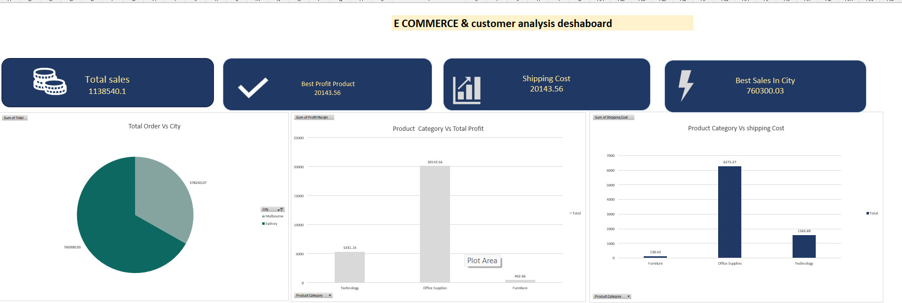
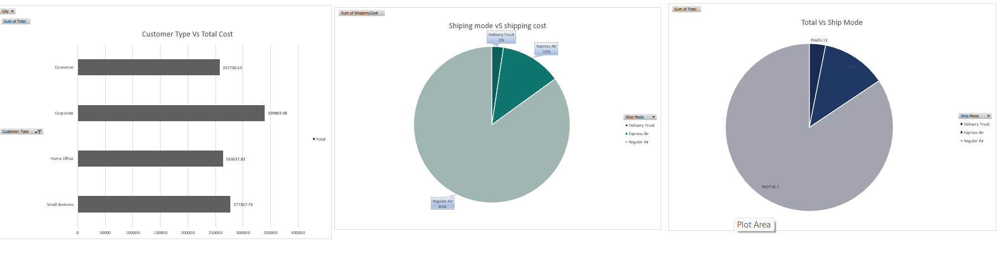
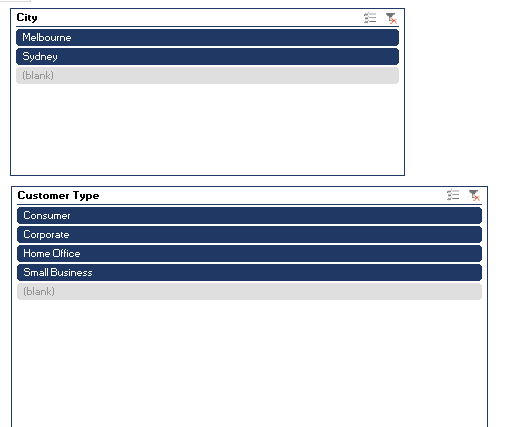

# E-Commerce & Customer Analysis Dashboard — Excel Portfolio Project

## Overview
An interactive sales and customer analytics dashboard built in **Microsoft Excel**
using PivotTables, PivotCharts, and slicers. The dashboard analyzes e-commerce
order data across cities, product categories, customer segments, and shipping
modes to support business decisions on market focus, product strategy, and
logistics cost.

**Tools used:** Microsoft Excel — Power Query for data cleaning, PivotTables,
PivotCharts, and Slicers for the dashboard. *Not Power BI.*

## Data Cleaning (Power Query)
Before analysis, the raw dataset was cleaned and prepared using Power Query,
including:
- Removing duplicate records
- Standardizing date formats
- Validating row counts after each cleaning step (via Applied Steps)
- Structuring the data into a clean table ready for PivotTable analysis

## Dashboard Views

### 1. Sales & Profit Overview
KPI cards for total sales, best profit product, shipping cost, and best sales
city, alongside city-wise order distribution, category-wise profit, and
category-wise shipping cost.

### 2. Customer & Shipping Analysis
Breakdown of total cost by customer type, shipping cost by delivery mode, and
overall order distribution by shipping mode.

### 3. Interactive Filters
Slicers for City and Customer Type let users filter all charts dynamically.

## Key Insights
1. **Sydney generates the highest revenue at ₹760,300** — nearly double
   Melbourne (₹378,240) — making Sydney the primary market focus.
2. **Office Supplies is the top-performing category**, generating ₹20,143 in
   profit, significantly ahead of Technology (₹5,111) and Furniture (₹462).
3. **Corporate and Small Business customers drive the most revenue**
   (₹339,804 and ₹277,368 respectively), making them the priority segments
   for retention and targeted marketing.
4. **Shipping cost is heavily skewed toward one delivery mode** — Regular Air
   accounts for the majority of shipping cost, suggesting an opportunity to
   review delivery mode selection for cost efficiency.

## Skills Demonstrated
- Data cleaning and transformation with Power Query
- PivotTables and PivotCharts for multi-dimensional analysis
- Interactive slicers for dynamic filtering
- KPI card design for dashboard summaries
- Deriving business insights from raw transactional data

## About This Project
Built as part of my Data Analyst portfolio, alongside SQL and Power BI work
on related e-commerce and retail datasets.
